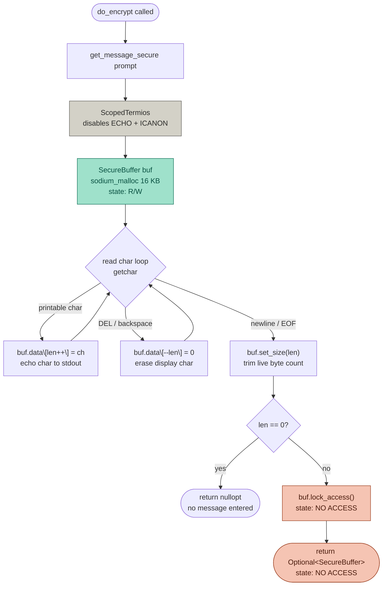
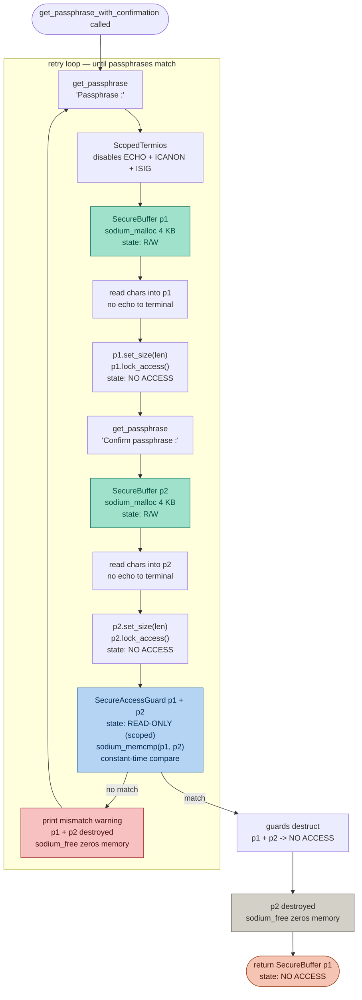
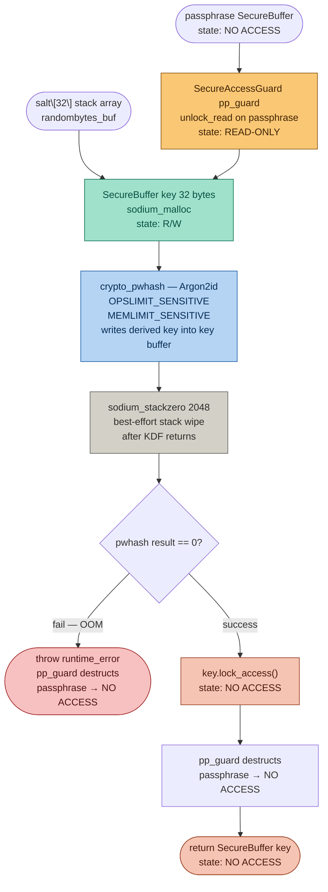
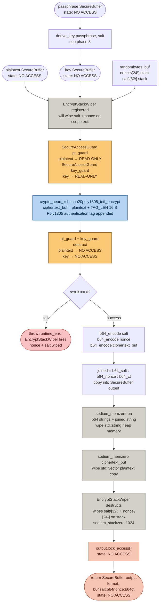

## Symetric Encryption

## Contents

- [Purpose](#purpose)
- [How it works](#how-it-works)
- [How to Build and Run](#how-to-build-and-run)
- [TODO - future improvements](#todo )


## Purpose
Encrypt and decrypt messages using libsodium's **crypto_aead_xchacha20poly1305_ietf_encrypt** function. 

Secret material — plaintext, passphrase, and derived key — is confined to sodium_malloc'd regions for the lifetime of each value:

- mlock'd — pages are pinned in RAM, preventing swap to disk
- mprotect'd — memory is set to no-access by default; unlocked read-only only for the duration of each cryptographic call, then re-locked immediately after
- zeroed on release — sodium_free guarantees a secure wipe before the region is returned to the OS

**Note**: this reduces key exposure risk by keeping private content in secure buffer while also making sure the memory region is manually wiped after use, but does not provide formal memory-safety guarantees for all C++ code paths. Created for learning purposes.

---
## How it works

There are four phases to the encryption process:
- Phase 1 — Get Input Message
- Phase 2 — Get Passphrase/password
- Phase 3 — Key Derivation ( passphrase + salt → key )
- Phase 4 — encrypt_message ( message + key + nonce → ciphertext )

*Wont be explaining the decryption process here, but it is very similar*
## Phase 1 — Get Input Message



**Buffer state summary**

| Step | State |
|------|-------|
| After `sodium_malloc` | R/W |
| While reading chars | R/W |
| After `set_size` | R/W |
| After `lock_access` | NO ACCESS |
| Returned to caller | NO ACCESS |

---

## Phase 2 — Get Passphrase



**Buffer state summary**

| Buffer | After alloc | During read | During compare | After compare | Returned |
|--------|-------------|-------------|----------------|--------------------------|----------|
| p1 | R/W | R/W | READ-ONLY (guard) | NO ACCESS | NO ACCESS |
| p2 | R/W | R/W | READ-ONLY (guard) | NO ACCESS, then destroyed | — |

---

## Phase 3 — Key Derivation



**Buffer state summary**

| Buffer | On entry | During KDF | After KDF | Returned |
|--------|----------|------------|-----------|----------|
| passphrase | NO ACCESS | READ-ONLY (guard) | NO ACCESS (guard destructs) | — |
| key | — | R/W | NO ACCESS | NO ACCESS |
| salt (stack) | — | readable | wiped by `sodium_stackzero` | — |

---

## Phase 4 — encrypt_message



**Buffer / memory state summary**

| Item | On entry | During AEAD | After AEAD | Returned |
|------|----------|-------------|------------|----------|
| plaintext | NO ACCESS | READ-ONLY (guard) | NO ACCESS | — |
| key | NO ACCESS | READ-ONLY (guard) | NO ACCESS | — |
| nonce (stack) | — | readable | wiped by `EncryptStackWiper` | — |
| salt (stack) | — | readable | wiped by `EncryptStackWiper` | — |
| ciphertext_buf (vector) | — | written by AEAD | zeroed by `sodium_memzero` | — |
| b64 strings (heap) | — | constructed | zeroed by `sodium_memzero` | — |
| output SecureBuffer | — | — | NO ACCESS | NO ACCESS |

---
---
## How to Build and Run

### Prerequisites
- A C++ compiler with C++17 support (e.g., `g++`)
- `libsodium` installed on your system
- install `pkg-config` if not already installed

---
### Verify libsodium 
pkg-config --modversion libsodium

### Build

Navigate to the `src` directory and compile the program:

```bash
g++ -std=c++17 -Wall -Wextra -pedantic -O2 \
  -fstack-protector-strong -D_FORTIFY_SOURCE=2 -fPIE \
  main.cpp \
  helper/encrypt_decrypt.cpp \
  helper/system_check.cpp \
  data-structure/SecureBuffer.cpp \
  data-structure/SecureAccessGuard.cpp \
  $(pkg-config --cflags --libs libsodium) \
  -pie \
  -o main
```
- Wextra: Enables additional compiler warnings beyond -Wall
- pedantic: Forces strict compliance with the C++ standard
- fstack-protector-strong: Detects stack buffer overflows at runtime
- fPIE: Makes your executable position-independent, Program gets loaded at random memory addresses each run

### Run
./main

---
### TODO

- get_message_secure terminal echo/prints - fix based on user needs
- SecureAccessGuard - bad for multithreaded
- sodium_stackzero(2048) unreliable
- Payload parsing - exception handling
